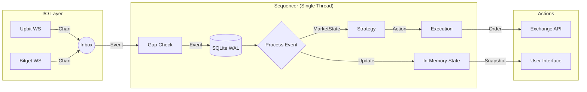

# CryptoGo: Quant Architecture & Logic Reference

**Role**: Quant Developer (Deterministic, Agile, Pragmatic).  
**MINDSET**: "Backtest is Reality." / "Complexity is the Enemy." / "Fail Fast."

---

## 1. DATA Principles (Pragmatic Integrity)

| Rule | Implementation | Rationale (Why?) |
|------|---------------|-------------------|
| **Money** | `int64` (Micros, Sats) | 부동소수점 오차(0.1 + 0.2 != 0.3) 원천 차단. 금융 데이터의 절대적 정합성 보장. |
| **Logic** | **NO Float** in Hotpath | 로직 내부에서 `float` 사용 시 "Hard Violation". |
| **Safety** | `pkg/safe` (Panic-on-Overflow) | 계좌 잔고나 가격 계산 오버플로우는 복구 불가능한 치명적 상태이므로, 즉시 중단(Fail-Fast)하여 원인 분석. |

### [Implementation Detail] `pkg/safe`
*   `SafeAdd`, `SafeSub`, `SafeMul`, `SafeDiv`
*   **검증**: 단순 연산이 아니라 경계값(MaxInt64 등) 체크 로직 포함.
*   **비용**: CPU 분기 예측으로 오버헤드 최소화. 안전이 성능보다 우선.

### [Implementation Detail] Balance Invariants (`internal/domain/Balance`)
*   **Strict Accounting**:
    1.  `Amount >= 0` (빚질 수 없음)
    2.  `Reserved >= 0` (음수 예약 불가)
    3.  `Reserved <= Amount` (가진 것보다 많이 걸 수 없음)
*   **Verification**: `VerifyInvariant()`는 상태 변경 직후 무조건 호출. 위반 시 즉시 `panic`.

---

## 2. ARCH Principles (The Sequencer)

| Rule | Implementation | Rationale (Why?) |
|------|---------------|-------------------|
| **Hotpath** | **Single Goroutine** | 상태(State) 경합(Race Condition)을 원천적으로 제거. Lock-free 코드로 복잡도 감소. |
| **Lock** | **NO Mutex** in Hotpath | Mutex는 컨텍스트 스위칭과 데드락의 원인. Hotpath는 '나 혼자' 쓰므로 Lock 불필요. |
| **Persistence**| **WAL (Write-Ahead Log)** | 모든 이벤트는 처리 전 `storage.EventStore`에 저장. 크래시 복구 및 완전한 상태 재현 보장. |

### [Implementation Detail] `internal/engine/Sequencer`
*   **Core Loop**: `for { select { case ev := <-inbox: process(ev) } }`
*   **Determinism**: 동일한 순서의 이벤트(WAL Replay)는 무조건 동일한 상태를 만들어야 함.
*   **Gap Detection**: 이벤트 시퀀스 번호(`Seq`)가 기대값과 다르면 즉시 `panic`. (데이터 유실 용납 불가)
*   **Backtest**: `ReplayEvent()` 메서드를 통해 라이브와 100% 동일한 로직으로 백테스팅 수행.



---

## 3. PERF Principles (Local Optimization)

| Rule | Implementation | Rationale (Why?) |
|------|---------------|-------------------|
| **Alloc** | **Zero-Alloc** in Loop | GC(가비지 컬렉터) Pause 방지. 초단타/고빈도 매매에서 Latency 튀는 현상 억제. |
| **Pooling** | `sync.Pool` (`internal/event`) | 빈번한 `MarketUpdateEvent` 생성/파괴 부하 제거. |
| **Layout** | Cache-Line Support | CPU 캐시 적중률 향상을 위해 자주 쓰는 필드(`Price`, `Qty`)를 구조체 앞부분에 배치. |

### [Implementation Detail] `internal/event/pool.go`
*   **Event Pooling**:
    *   `AcquireMarketUpdateEvent()` -> Pool에서 객체 획득.
    *   이벤트 처리 완료 후 `ReleaseMarketUpdateEvent()` -> 필드 초기화 후 반납.
    *   GC 압력을 획기적으로 줄여 Latency Jitter 방지.

### [Implementation Detail] `internal/strategy` (Ring Buffer)
*   **SMA Calculation**:
    *   `make([]int64, N)`으로 초기화 후 덮어쓰기.
    *   `append` 사용 금지 (힙 할당 방지).
    *   `Sum` 캐싱으로 O(1) 계산 유지.

---

## 4. DOMAIN & STATE (Memory Layout)

### `internal/domain/MarketState`
```go
type MarketState struct {
    // Hot Fields (8-byte aligned) - CPU Cache Line 적중 유도
    PriceMicros     int64
    TotalQtySats    int64
    LastUpdateUnixM int64
    // Cold Fields
    Symbol          string
}
```

### `internal/domain/Balance`
*   **구조**: `Available`, `Reserved` (int64)
*   **기능**: 자산별(USDT, BTC 등) 잔고 및 주문 예약금(Reserved) 관리.
*   **스냅샷**: `Snapshot()` 메서드로 현재 상태를 덤프하여 디버깅/복구 지원.

---

---

## 5. DECISION MANAGEMENT (Standard Hygiene)

### [Implementation Detail] ADR (Architecture Decision Records)
*   프로젝트의 중요한 설계 결정은 `docs/adr/*.md`에 기록됩니다.
*   **포맷**: Context(현황 및 배경), Decision(결정 내역), Consequences(결과 및 영향)를 포함.
*   **보존**: 결정의 '이유'를 깃 히스토리와 함께 보존하여, 기술 부채를 방지하고 "Quant" 철학을 유지합니다.

### [Implementation Detail] Workspace Separation (`_workspace/`)
*   **Isolation**: 소스코드(`cmd`, `internal`)와 런타임 데이터(`secrets`, `data`, `logs`)를 폴더 수준에서 완전히 격리.
*   **Security**: `.gitignore`에 `_workspace/` 하나만 등록하여 하위 모든 파일의 외부 유출 방지. 만약의 실수(`git add .`)를 막는 물리적 방어선.
*   **Reproducibility**: `_workspace` 내의 모든 환경 파일은 팀 내에서 공유되는 템플릿(`configs/`)을 통해 재현.

---

## 6. SYSTEM STRUCTURE (Current)
```
/
├── cmd/            # Entry Points (app, integration)
├── internal/       # Core Logic
│   ├── domain/     # Entity (Balance, MarketState)
│   ├── engine/     # Sequencer (WAL + Single Thread)
│   ├── strategy/   # Trading Logic
│   ├── execution/  # Order Submission
│   ├── event/      # Event Pooling
│   └── infra/      # Exchange Adapters (Upbit/Bitget)
├── pkg/            # Core Utilities (SafeMath, Quant)
├── docs/           # Documentation (ADR)
└── _workspace/     # [IGNORED] Local Runtime (Secrets, Data, Logs)
```


---

## 8. INFRA Decisions (Pragmatism)

| Component | Decision | Rationale |
|-----------|----------|-----------|
| **Bitget Spot** | API V2 | 최신 표준 준수 (Modern API). |
| **Bitget Futures** | API V2 (`USDT-FUTURES`) | `USDS-FUT` 문서 오류 수정 -> `USDT-FUTURES`로 해결. (V2 통합) |
| **ExchangeRate** | 환율 API | 안정적 환율 소스. Provider 교체 가능 구조. |
| **Backoff** | Shared Exponential | 모든 연결 재시도 로직에 `infra.Backoff` 표준 적용 (Jitter 포함). |

---

## 9. MVP SCOPE (Monitoring & Trading Skeleton)

### **Definition of MVP**
> "실계좌 데이터를 완벽하게 보고(Monitoring), 매매 시스템의 뼈대(Skeleton)를 갖추는 것."

### **1. Core: Coin Price Monitoring (IMPLEMENTED)**
*   **Data Aggregation**: Upbit(KRW), Bitget(USDT), ExchangeRate(USD) 데이터 실시간 통합.
*   **Zero-Risk**: 매매 로직 없이 오직 '관찰'만 수행하므로 자산 손실 위험 0%.
*   **Goal**: "눈으로 보는 데이터가 실제 거래소와 100% 일치해야 한다."

### **2. Foundation: Automated Trading Structure (IMPLEMENTED)**
*   **Structural Readiness**: 당장 매매는 안 하지만, 언제든 로직만 채우면 돌아가도록 설계.
*   **Interface-First**:
    *   `Strategy`: `OnMarketUpdate(state, outBuf) -> count` (Zero-Alloc Hotpath)
    *   `Execution`: `SubmitOrder(Order)` (Mock & Real Interface)
*   **Why?**: "건축 도면(Interface) 없이 벽돌(Code)부터 쌓지 않는다."

---

## 10. ADVANCED FEATURES (초고도화)

### **Performance**
| 기능 | 결과 |
|------|------|
| **Benchmark** | Hotpath ~5 ns/op, **Zero-Alloc** (100% Pool/Buffer) |
| **Optimization** | **Cache-Line Alignment** (Padding 0), **No Float** |

### **Reliability**
| 기능 | 용도 |
|------|------|
| **Circuit Breaker** | 외부 API 장애 시 자동 차단 |
| **Snapshot System** | 빠른 상태 복구 (WAL 전체 재생 불필요) |

### **Trading**
| 기능 | 용도 |
|------|------|
| **Paper Trading** | 가상 잔고로 전략 검증 |
