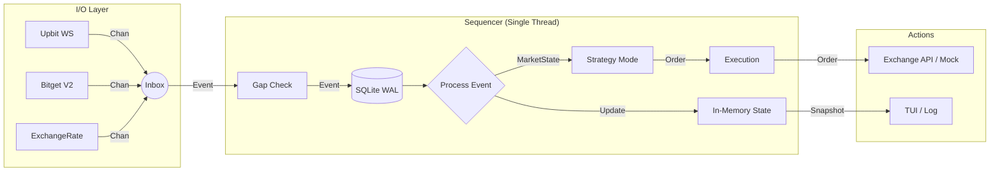

# 🚀 CryptoGo: Quant Framework


**CryptoGo**는 초고속 의사결정과 완벽한 검증(Backtest is Reality)을 목표로 하는 **Go 언어 기반의 결정론적(Deterministic) 퀀트 트레이딩 프레임워크**입니다.

> **Current Status**: MVP Phase 1 (Monitoring Implemented / Trading Skeleton Ready)

---

## 🎯 MVP Scope

### 1. Monitoring First (✅ Implemented)
*   **Data Aggregation**: Upbit(KRW), Bitget(USDT), Exchange Rate(USD/KRW) 데이터를 실시간 통합.
*   **Zero-Risk**: 매매 로직 없이 시장을 완벽하게 관찰하는 것을 최우선 목표로 함.
*   **Infrastructure**:
    *   **Bitget**: Spot & Futures 모두 최신 **V2 API** 적용 (`USDT-FUTURES`).
    *   **Exchange Rate**: 환율 API를 통한 안정적 환율 수신.

### 2. Trading Skeleton (✅ Ready)
*   **Architecture**: 매매 로직을 담을 그릇(Interface)과 데이터 구조(Entity) 완성.
*   **Mock Execution**: 실제 주문 전송 없이 로직을 검증할 수 있는 안전 장치.

---

## 🏛️ 아키텍처 (Architecture)

모든 데이터 흐름은 **Sequencer**라고 불리는 단일 파이프라인(Hotpath)을 통과합니다.



### 핵심 원칙
1.  **Single Threaded**: 모든 상태 변경은 단일 고루틴에서 순차 처리 (No Mutex, No Deadlock).
2.  **Int64 Only**: 돈과 수량은 오직 `int64` (Micros/Sats)만 사용. `float` 사용 시 빌드 경고.
3.  **Fail Fast**: 오버플로우나 데이터 유실 감지 시 즉시 시스템 중단 (Panic).

---

## 🛠️ 모듈별 상세 (Modules)

### 1. `internal/domain` (Entities)
*   **`Order` / `Position`**: 매매의 핵심 객체. 엄격한 타입 정의 (`PriceMicros`, `QtySats`).
*   **`MarketState`**: 통합된 시장 상황 (현재가, 호가 등).

### 2. `internal/infra` (Gateways)
*   `upbit`: 업비트 웹소켓 (KRW 마켓).
*   `bitget`: 비트겟 V2 API (Spot / Futures `USDT-FUTURES`).
*   `exchange_rate`: USD/KRW 환율 정보.
*   **Common**: 지수 백오프(Exponential Backoff) 표준 적용.

### 3. `internal/strategy` (Logic)
*   **Interface**: `OnMarketUpdate(state, outBuf) -> int` (Zero-Alloc).
*   **Reference**: `SMACrossStrategy` (Ring Buffer 최적화, ~16ns/op).

### 4. `internal/execution` (Action)
*   **Interface**: `SubmitOrder`, `CancelOrder`.
*   **MockExecution**: MVP 단계에서의 안전한 테스트 실행기.
*   **PaperExecution**: 가상 잔고로 전략 검증.

### 1. 프로젝트 구조 (Structure)
```
/
├── cmd/               # [UPLOAD] 실행 포인트 (app, integration)
├── internal/          # [UPLOAD] 도메인 및 비즈니스 로직
├── pkg/               # [UPLOAD] 공용 라이브러리 (SafeMath, Quant)
├── configs/           # [UPLOAD] 설정 템플릿 (공개용)
├── docs/              # [UPLOAD] 문서 (ADR, 설계도)
├── scripts/           # [UPLOAD] 관리 스크립트 (Git Hooks 등)
└── _workspace/        # [IGNORED] 로컬 실행 환경 (민감 데이터 격리)
    ├── secrets/       # API Key (demo.yaml, real.yaml)
    ├── data/          # SQLite DB (events.db)
    └── logs/          # 애플리케이션 로그
```

### 2. 가동 준비 (Setup)
1.  `_workspace/secrets` 폴더를 생성합니다. (이미 존재할 수 있음)
2.  `secrets/demo.yaml` 등의 키 파일을 `_workspace/secrets`로 이동합니다.
3.  `go run cmd/app/main.go` 실행 시 자동으로 `_workspace`가 활용됩니다.

### 5. SEC: ESSENTIAL HYGIENE
*   **Keys**: `[]byte` storage. Wipe on Exit (`defer`).
*   **Net**: Retry + Timeout (Context). Simple Error Logging.
*   **Git Security**:
    *   **Pre-commit Hook**: `_workspace/` 외의 경로에 비밀번호나 키가 포함되는 것을 원천 차단.
    *   **Workspace Separation**: 소스코드와 런타임 데이터를 물리적으로 분리하여 실수에 의한 유출 방지.

### 6. OBS: LEAN METRICS
*   **Latency**: p99 < 1ms 지향 (Hotpath ~5-15ns 수준).
*   **Zero-Alloc**: 핫패스 내 힙 할당 **0 B/op** 달성.
*   **Audit**: `_workspace/logs/app.log`에서 모든 패닉 및 예외 상황 추적 가능 (스택 트레이스 포함).

### 10. Linux OS 실행 가이드
우리 프로젝트는 플랫폼 독립적으로 설계되어 있어, Ubuntu, Fedora, Arch 등 다양한 리눅스 데스크탑 환경에서 완벽하게 작동합니다.

#### 리눅스용 빌드 (Cross-Compile)
윈도우 PowerShell에서 리눅스용 실행 파일(Native Binary)을 빌드합니다:
```bash
$env:GOOS="linux"; $env:GOARCH="amd64"; go build -o crypto-go-linux ./cmd/app/main.go
```

#### 실행 및 사용법 (How to Run)
1.  빌드된 `crypto-go-linux` 파일을 리눅스 환경으로 복사합니다.
2.  `_workspace/` 및 `configs/` 폴더를 같은 위치로 복사합니다. (설정 및 데이터 유지)
3.  터미널(Terminal)을 열고 해당 폴더로 이동한 뒤 실행 권한을 부여하고 가동합니다:
    ```bash
    chmod +x crypto-go-linux
    ./crypto-go-linux
    ```

> [!NOTE]
> 데스크탑 사용자의 경우, 터미널에서 실행하면 실시간 로그와 명령 프롬프트를 통해 즉각적인 피드백을 확인할 수 있습니다.

> [!TIP]
> 우리 프로젝트는 **Pure Go SQLite** 드라이버를 사용하므로, 리눅스 환경에 추가적인 라이브러리(CGO 관련)를 설치할 필요가 전혀 없습니다.

### 7. `internal/infra` (Advanced)
*   **Circuit Breaker**: 외부 API 장애 자동 격리.
*   **Metrics**: Atomic Counter 기반 경량 모니터링.

### 8. `internal/storage` (Persistence)
*   **WAL**: 이벤트 로깅 및 복구.
*   **Snapshot**: 빠른 상태 복원.

---

## 🚀 시작하기 (Getting Started)

### 요구 사항
*   Go 1.21 이상

### 실행 및 테스트
```bash
# 1. 의존성 설치
go mod tidy

# 2. 유닛 테스트 (전체 검증)
go test -v -race ./...

# 3. 실행 (향후 메인 루프 구현 예정)
go run cmd/app/main.go
```

---

*Created by Quant Team based on Deterministic Architecture.*


