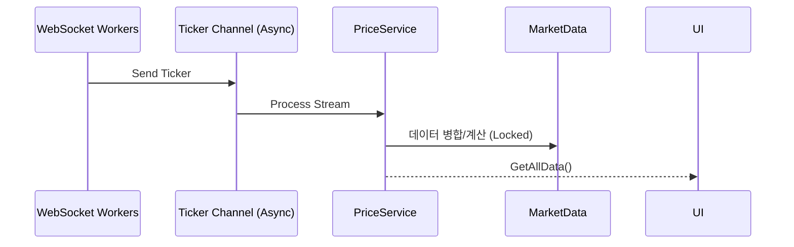
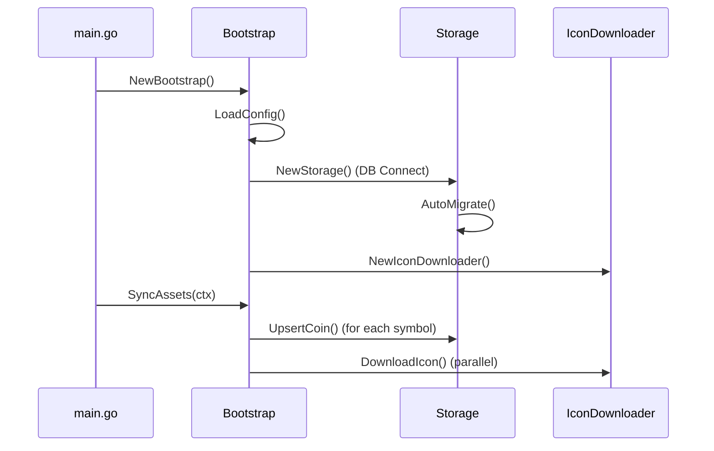

# 크립토 고 (Crypto Go) 시스템 아키텍처

**버전**: 2.0
**최종 수정일**: 2026-01-07

---

## 1. 레이어 구조 (Layer Architecture)

```
┌─────────────────────────────────────────────────────────────┐
│                        cmd/app                              │
│                  (진입점, DI, 생명주기)                       │
├─────────────────────────────────────────────────────────────┤
│                          app                                │
│               (Bootstrap, 초기화 오케스트레이션)              │
├─────────────────────────────────────────────────────────────┤
│                        service                              │
│                (비즈니스 로직, 상태 관리)                     │
├─────────────────────────────────────────────────────────────┤
│                        domain                               │
│              (엔티티, 인터페이스, 순수 로직)                  │
├─────────────────────────────────────────────────────────────┤
│                         infra                               │
│     (외부 API, WebSocket, 설정 로드, Storage, Logger)        │
└─────────────────────────────────────────────────────────────┘
```

---

## 2. 의존성 규칙 (Dependency Rules)

```mermaid
graph TD
    CMD[cmd/app] --> APP[app]
    CMD --> SVC[service]
    CMD --> INFRA[infra]
    APP --> INFRA
    APP --> STORAGE[infra/storage]
    SVC --> DOM[domain]
    INFRA --> DOM
    STORAGE --> DOM
    
    style DOM fill:#2d5016,stroke:#4ade80
    style SVC fill:#1e40af,stroke:#60a5fa
    style INFRA fill:#7c2d12,stroke:#fb923c
    style STORAGE fill:#4c1d95,stroke:#a78bfa
    style APP fill:#701a75,stroke:#f0abfc
    style CMD fill:#0f172a,stroke:#94a3b8
```



**핵심 원칙**: 안쪽 레이어는 바깥 레이어를 알지 못함
- `domain`은 어떤 패키지도 import하지 않음
- `app`은 초기화만 담당하고 비즈니스 로직을 포함하지 않음

---

## 3. 핵심 컴포넌트 (Core Components)

### 3.1 Domain Layer
| 파일 | 설명 |
|------|------|
| `ticker.go` | `Ticker`, `MarketData` 엔티티 정의 |
| `entity.go` | `CoinInfo`, `AppConfig` 영속성 엔티티 |
| `alert.go` | `AlertConfig` 알림 설정 엔티티 |
| `interfaces.go` | `ExchangeWorker`, `ExchangeRateProvider` 인터페이스 |
| `errors.go` | 도메인 에러 정의 |

### 3.2 Service Layer
| 파일 | 설명 |
|------|------|
| `price_service.go` | 시장 데이터 상태 관리, 티커 업데이트 처리 |

### 3.3 Infrastructure Layer
| 파일 | 설명 |
|------|------|
| `config.go` | YAML 설정 로드, 환경 변수 오버라이드, 유효성 검사 |
| `logger.go` | `slog` + `lumberjack` 기반 구조화 로깅 및 자동 순환 |
| `upbit_worker.go` | 업비트 WebSocket 연결 및 재연결 |
| `bitget_spot.go` | 비트겟 현물 WebSocket |
| `bitget_futures.go` | 비트겟 선물 WebSocket (펀딩비 포함) |
| `exchange_rate.go` | USD/KRW 환율 조회 |
| `icon_downloader.go` | 코인 아이콘 CDN 다운로드 및 로컬 캐싱 |

### 3.4 Storage Layer (NEW)
| 파일 | 설명 |
|------|------|
| `storage/sqlite.go` | SQLite + GORM 기반 Repository 패턴 구현 |
| | - `CoinInfo` CRUD (심볼, 아이콘, 즐겨찾기) |
| | - `AppConfig` Key-Value 저장 |
| | - Auto Migration 지원 |

### 3.5 Application Layer (NEW)
| 파일 | 설명 |
|------|------|
| `app/bootstrap.go` | 앱 부팅 시퀀스 오케스트레이터 |
| | - 설정 로드 → 로거 설정 → DB 연결 → 자산 동기화 |

---

## 4. 데이터 흐름 (Data Flow)

### 4.1 실시간 시세 흐름


### 4.2 부팅 시퀀스 (Startup)


---

## 5. 데이터 영속성 (Data Persistence)

### 5.1 저장소 위치 (Windows)
| 유형 | 경로 |
|------|------|
| **Database** | `%LocalAppData%\CryptoGo\data\cryptogo.db` |
| **Icons** | `%LocalAppData%\CryptoGo\assets\icons\` |
| **Config** | `configs/config.yaml` (프로젝트 내) |

### 5.2 DB 스키마 (SQLite)
```sql
-- CoinInfo
CREATE TABLE coin_infos (
    symbol TEXT PRIMARY KEY,
    name TEXT,
    icon_path TEXT,
    is_active BOOLEAN,
    is_favorite BOOLEAN,
    last_synced_at DATETIME,
    created_at DATETIME,
    updated_at DATETIME
);

-- AppConfig
CREATE TABLE app_configs (
    key TEXT PRIMARY KEY,
    value TEXT,
    updated_at DATETIME
);
```

---

## 6. 보안 및 안정성 설계 (Security & Stability)

### 6.1 보안 조치
| 영역 | 조치 |
|------|------|
| **SQL Injection** | GORM Prepared Statement 자동 적용 |
| **Path Traversal** | 파일명 Sanitize (알파벳/숫자만 허용) |
| **API Key** | 환경 변수 오버라이드 지원 |
| **Transport** | 모든 외부 통신 TLS(https/wss) 사용 |

### 6.2 안정성 조치
| 영역 | 조치 |
|------|------|
| **Thread Safety** | WebSocket Write Mutex, Deep Copy 반환 |
| **Graceful Shutdown** | `signal.NotifyContext` 기반 종료 |
| **Log Rotation** | 10MB/3백업/28일 자동 삭제 |
| **Connection Leak** | HTTP Transport `IdleConnTimeout` 설정 |
| **Profiling** | `pprof` 엔드포인트 (`localhost:6060`) |

---

## 7. 설계 원칙 (Design Principles)

1. **API 스펙 준수**: 거래소 API 자료형 그대로 사용 후 내부 변환
2. **정밀 연산**: `shopspring/decimal`로 부동소수점 오차 방지
3. **Context 기반**: 모든 장기 실행 작업은 `context.Context` 전달
4. **인터페이스 분리**: 테스트 용이성을 위한 의존성 주입
5. **Pure Go**: CGO 없이 크로스 컴파일 가능 (glebarez/sqlite)
